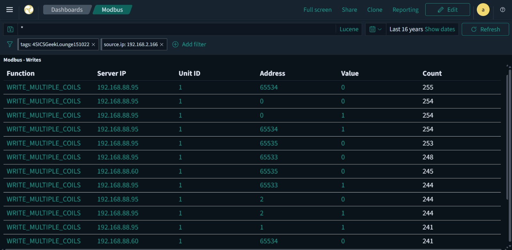

# ICS Network Traffic Analysis with Malcolm — 4SICS Geek Lounge Dataset

A self-directed learning project: deploying CISA's **Malcolm** network analysis
suite from scratch and using it to investigate three days of real ICS attack
traffic from the 4SICS "Geek Lounge" conference lab.

> ⚠️ Public training dataset (Netresec). The "attackers" were authorized
> conference participants attacking demonstration equipment — not a real incident.

## What this project covers
- Deploying Malcolm (Zeek + Suricata + Arkime + OpenSearch) on an Ubuntu VM
- Ingesting and analyzing three PCAPs (25 MB / 134 MB / 200 MB)
- Tracing a complete ICS attack across three days
- Producing an evidence-backed report with explicit confidence levels

## Environment
Malcolm running on an Ubuntu VM, accessed over HTTPS:

## The three-day story
| Day | Phase | Key finding |
|-----|-------|-------------|
| 1 (151020) | Baseline | Normal operations + benign noise; no attackers |
| 2 (151021) | Reconnaissance | Web scanning + Modbus/S7comm fingerprinting; **no writes** |
| 3 (151022) | Manipulation | Modbus attack with ~10,584 acknowledged coil-writes |

## Key evidence — Day 3 Modbus write attack

Modbus dashboard filtered to the attacker (`source.ip: 192.168.2.166`) on the
Day 3 capture, showing repeated `WRITE_MULTIPLE_COILS` commands against control
devices `192.168.88.95` and `192.168.88.60`:

Note the write **addresses (65533–65535)** — the very top of the coil address
range. Combined with a high command-rejection rate and invalid function codes
elsewhere in the session, this pattern indicates **protocol fuzzing/probing**
rather than purposeful set-point manipulation.

## Key lesson
The unfiltered data initially suggested an attacker wrote to the Siemens PLC.
Filtering strictly by source IP corrected this — those writes were legitimate
control traffic, and the attacker had only made failed connection attempts.
**Verify source attribution before drawing conclusions.**

## Tools & skills
`Malcolm` `Zeek` `Suricata` `Arkime` `OpenSearch` · Modbus / S7comm / DNP3 ·
passive asset identification · alert triage · network forensics ·
distinguishing observation from assessment

## Full report
See the [project report](Malcolm_4SICS_Full_Project_Report.pdf) for the complete
writeup: environment setup → methodology (including real dead-ends and
course-corrections) → all three days → findings → recommendations → lessons learned.

## Dataset
[4SICS Geek Lounge captures](https://www.netresec.com/?page=PCAP4SICS) — Netresec.
PCAPs are not redistributed here; download them from the source above to reproduce.

---
*Self-directed learning project. AI was used as a tutor during the learning process.*
